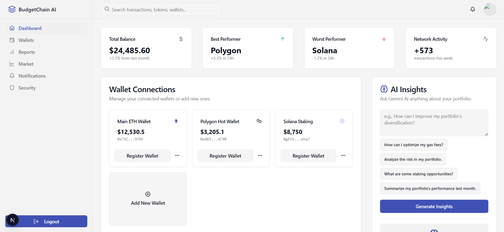
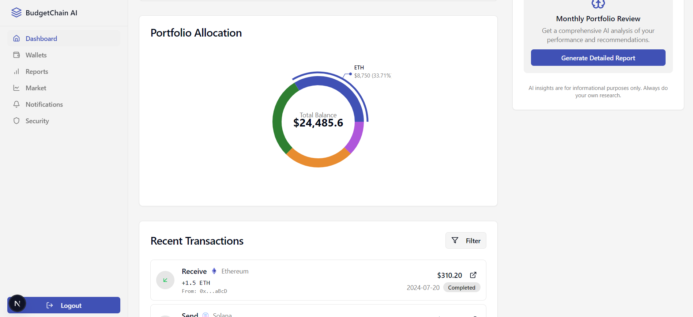
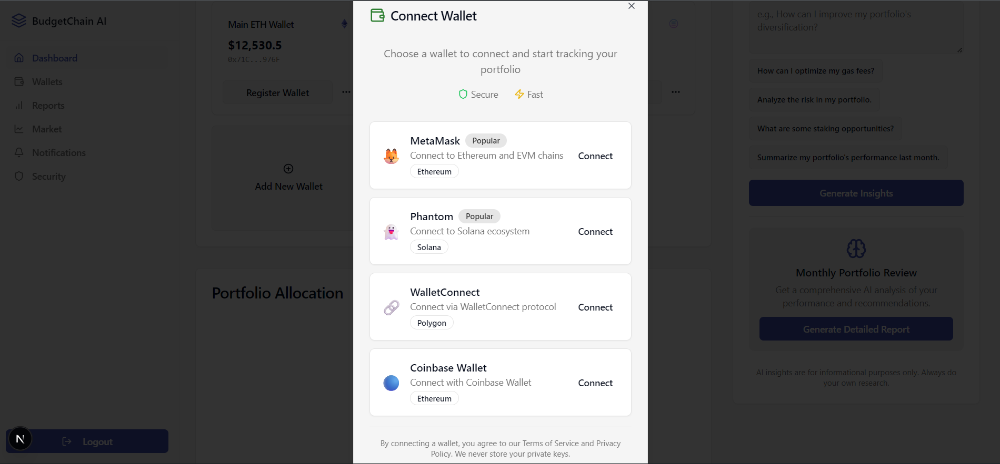
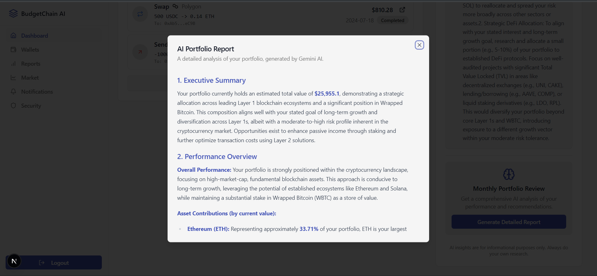
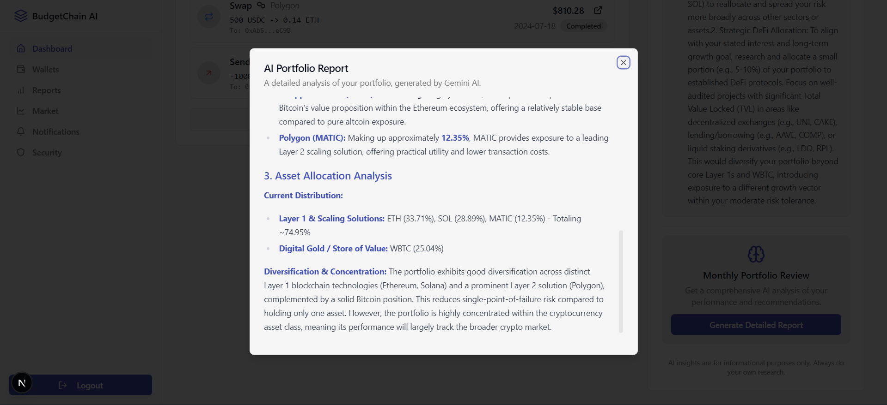
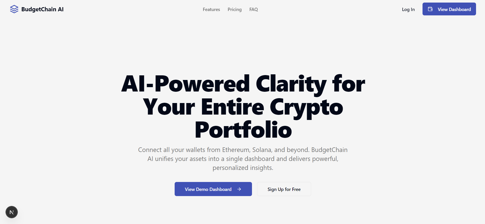

# BudgetChain AI: Cross-Chain Crypto Portfolio Dashboard

BudgetChain AI is an advanced, AI-powered cryptocurrency portfolio tracker designed to provide a seamless and unified experience for managing digital assets across multiple blockchains. It aggregates data from various wallets (like Ethereum, Solana, and Polygon) into a single, intuitive dashboard. Leveraging the power of Google's Gemini models via Genkit, it offers personalized insights, detailed reports, and actionable recommendations to help users optimize their portfolios.

BudgetChain AI Dashboard


Portfolio Allocation


Connecting a Wallet


Monthly Report



Main Site



## ✨ Key Features

- **Unified Multi-Chain Dashboard**: Connect wallets from different blockchains (Ethereum, Solana, Polygon, etc.) and view all your assets and their total value in one place.
- **AI-Powered Insights (Gemini)**: Ask natural language questions about your portfolio and receive intelligent, actionable advice. Get insights on gas fee optimization, risk analysis, and staking opportunities.
- **Detailed Portfolio Reports**: Generate comprehensive, on-demand portfolio analysis reports in Markdown, complete with performance overviews, risk assessment, and personalized recommendations.
- **Secure & Private**: The application uses read-only access to public wallet data, ensuring your private keys never leave your possession.
- **Interactive Charts**: Visualize your portfolio allocation with interactive donut charts and track historical performance with area charts.
- **Transaction & Market Data**: Monitor recent transactions and stay up-to-date with the latest cryptocurrency market trends.
- **Customizable Experience**: Switch between light and dark modes and set your preferred currency, with all preferences saved locally.

## 🛠️ Tech Stack

- **Framework**: [Next.js](https://nextjs.org/) (with App Router)
- **Language**: [TypeScript](https://www.typescriptlang.org/)
- **Styling**: [Tailwind CSS](https://tailwindcss.com/)
- **UI Components**: [ShadCN/UI](https://ui.shadcn.com/)
- **AI/Generative**: [Genkit (Google's Generative AI Toolkit)](https://firebase.google.com/docs/genkit)
- **Charts**: [Recharts](https://recharts.org/)
- **Icons**: [Lucide React](https://lucide.dev/guide/packages/lucide-react)

## 🚀 Getting Started

Follow these instructions to set up and run the project on your local machine.

### Prerequisites

- [Node.js](https://nodejs.org/) (v18 or later)
- [npm](https://www.npmjs.com/) or a compatible package manager

### 1. Clone the Repository

```bash
git clone https://github.com/geoffreymagana/BudgetChain-AI.git
cd BudgetChain-AI
```

### 2. Install Dependencies

Install the required packages using npm:

```bash
npm install
```

### 3. Set Up Environment Variables

This project uses Google's Gemini models for its AI features. You'll need a Gemini API key to run the application.

1.  Create a `.env` file in the root of the project.
2.  Obtain an API key from [Google AI Studio](https://aistudio.google.com/app/apikey).
3.  Add the key to your `.env` file:

```env
GEMINI_API_KEY=your_gemini_api_key_here
```

### 4. Run the Development Servers

You need to run two development servers simultaneously: one for the Next.js frontend and another for the Genkit AI flows.

- **Terminal 1: Start the Next.js App**

```bash
npm run dev
```

Your application will be available at `http://localhost:9002`.

- **Terminal 2: Start the Genkit AI Server**

```bash
npm run genkit:dev
```

This starts the Genkit development server, which makes the AI flows available for the Next.js application to call.

## 📂 Project Structure

The project follows a standard Next.js App Router structure with some key directories:

```
src
├── app/                  # Main application routes (pages, layouts)
│   ├── (marketing)/      # Routes for the marketing/landing page
│   ├── dashboard/        # Authenticated dashboard routes
│   │   ├── layout.tsx
│   │   └── page.tsx
│   ├── layout.tsx        # Root layout
│   └── globals.css       # Global styles and Tailwind directives
├── ai/                   # Genkit AI configuration and flows
│   ├── flows/            # All Genkit flow definitions
│   └── genkit.ts         # Global Genkit initialization
├── components/           # Reusable React components
│   ├── dashboard/        # Components specific to the dashboard
│   ├── icons/            # Custom icon components
│   └── ui/               # ShadCN UI components
├── hooks/                # Custom React hooks (e.g., useToast)
└── lib/                  # Utility functions, types, and mock data
    ├── mock-data.ts      # Placeholder data for wallets, tokens, etc.
    ├── types.ts          # TypeScript type definitions
    └── utils.ts          # General utility functions (e.g., cn for classnames)
```

## 🤖 AI Features with Genkit

The AI capabilities of this application are built using **Genkit**. Genkit flows are defined in the `src/ai/flows/` directory. These are server-side functions that interact with the Gemini models.

- **`generatePortfolioInsights.ts`**: Takes a user's portfolio data and a natural language query to provide specific, targeted advice.
- **`generateDetailedPortfolioReport.ts`**: Generates a full, structured report analyzing the user's portfolio.
- **`determineRegistrationEligibility.ts`**: An example flow that uses AI to predict the likelihood of a blockchain transaction succeeding.

These flows are called from the Next.js application via Server Actions defined in `src/app/actions.ts`.

## 📜 Available Scripts

- `npm run dev`: Starts the Next.js development server.
- `npm run genkit:dev`: Starts the Genkit development server for AI flows.
- `npm run build`: Creates a production build of the application.
- `npm run start`: Starts the production server.
- `npm run lint`: Lints the codebase using Next.js's built-in ESLint configuration.
